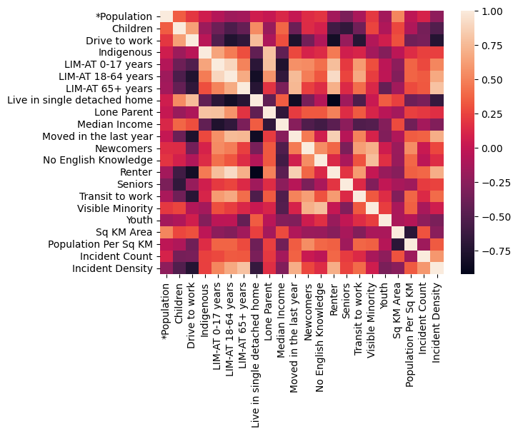
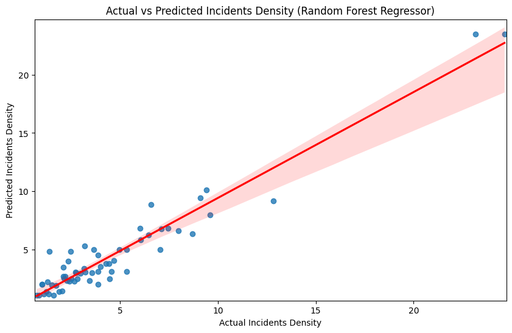
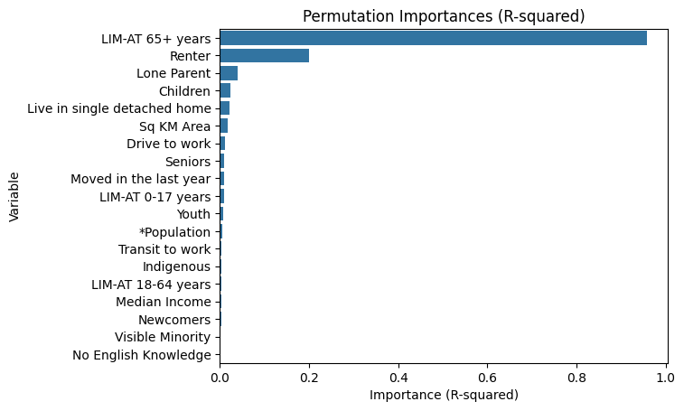

# Predicting Traffic Incident Density Using Equity Indicators

**Course:** DATA 601 – Introduction to Data Science, University of Calgary
**Team:** Bhuvan Dubey, Andrew Gellner, Tony Steere, Lovette Daminabo

## Problem

Can traffic incident density in Calgary's Community Service Areas (CSAs) be predicted from
socioeconomic and equity indicators? Rather than raw incident counts, the project uses **Incident
Density** (incidents per km² per year) so that CSAs of very different sizes and shapes can be
compared fairly. A model that reliably flags where incidents concentrate could support resource
allocation and safety planning decisions.

## Approach

The project progressed across three stages, each building on the last:

**1. Exploratory Data Analysis** — pulled Traffic Incidents, Traffic Volumes, and Speed Limits
directly from the City of Calgary Open Data API, and Equity Index and Bikeway data from local
GeoJSON extracts. Cleaned, reprojected, and spatially joined the datasets, then visualized
distributions and computed correlations between incident counts and equity indicators by area.

**2. Making Predictions** — refined the join logic (adding Ward-level attributes and switching to a
more robust Equity Index source), engineered the CSA-level features, and built an initial predictive
model as a first pass at the regression problem.

**3. Final Model & Report** — consolidated the pipeline into a single reproducible `get_data()`
workflow, engineered the final feature set, and fit a **Random Forest Regressor** to predict Incident
Density from equity/demographic indicators:

- Downloaded Incidents (2022–2024) and Equity Index (2021 Census, CSA-level) data in 25,000-record
  chunks to avoid API truncation.
- Cleaned and reprojected both datasets to a common CRS (EPSG:3395), pivoted the Equity Index from
  long to wide format, and converted percentage-based metrics to proportions.
- Calculated each CSA's area (km²) and population density, then filtered to the middle 90% of CSAs by
  population density to exclude atypical outliers from training.
- Spatially joined Incidents to CSAs, aggregated to Incident Year × CSA, and left-joined back to the
  Equity dataset (filling CSAs with zero incidents rather than dropping them) to compute the target
  variable, Incident Density.
- Trained/tested on an 80/20 split, evaluated with R², cross-validation, MSE, and RMSE, and used
  **permutation importance** to identify which equity indicators drove the model's predictions.

## Key Results

| Metric | Value |
|---|---|
| Train R² | 0.9808 |
| **Test R²** | **0.9242** |
| Mean CV R² | 0.88 ± 0.10 |
| MSE | 1.46 |
| RMSE | 1.21 |

- The switch from a raw **incident rate** to **incident density** (incidents/km²), combined with
  pulling in multiple years of incident data, was the single biggest driver of model accuracy.
- **Permutation importance** identified the proportion of residents 65+ living below the low-income
  measure (**LIM-AT 65+ years**) as by far the strongest predictor (R² importance ≈ 0.95), followed by
  **renter status** (≈ 0.25) and **lone-parent households** — all other features (children present,
  area size, commute/housing characteristics) contributed comparatively little.
- A correlation heatmap showed Incident Density positively correlated with LIM-AT 65+ years, recent
  moves, and renter status, and negatively correlated with driving to work and living in a
  single-detached home — consistent with the permutation importance ranking.
- Predicted vs. actual density values clustered tightly around the 1:1 line, indicating the model
  generalizes well within the population-density range it was trained on.

## Tech Stack

Python (pandas, geopandas, scikit-learn, matplotlib, seaborn, shapely, plotly), City of Calgary Open
Data API.

## Files

- `code/01_Exploratory_Data_Analysis.ipynb` — initial data pull, cleaning, spatial joins, and
  correlation exploration (Project 1)
- `code/02_Making_Predictions.ipynb` — refined joins and first predictive modeling pass (Project 2,
  final revised version)
- `code/03_Final_Model_And_Report.ipynb` — consolidated pipeline, final Random Forest model, and
  permutation importance analysis (Project 3)
- `report/DATA_601_Final_Report.docx` — full written report (introduction, methods, results,
  discussion, references)
- `figures/` — the three figures referenced in the final report
- `data/` — local reference copies of the Equity Index and Bikeways GeoJSON files (the notebooks pull
  Traffic Incidents, Volumes, and Speed Limits directly from the City of Calgary Open Data API at
  runtime, so those aren't duplicated here)
