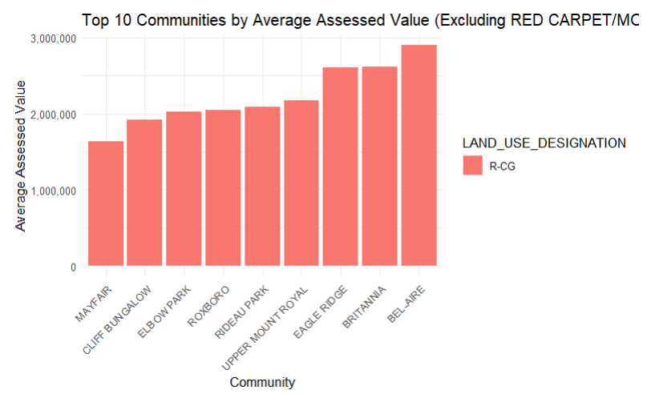
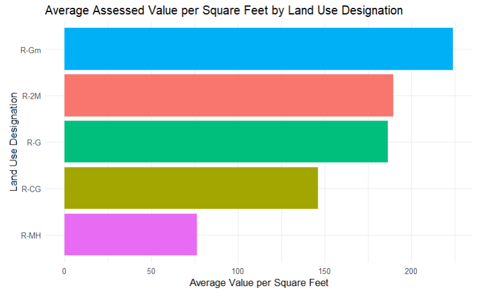

# Analyzing the Influence of Neighbourhood and Other Property Attributes on Calgary's 2025 Property Assessment Values

**Course:** DATA 603, University of Calgary
**Group Members:** Bhuvan Dubey, Jimoh Adewumi, Adewale Adewumi

## Problem

Municipal property assessments determine how property taxes are allocated
across a city, and are meant to track real estate market fundamentals. This
project asks: what parcel-level and community-level factors explain Calgary's
2025 assessed property values, and do differences in assessed value across
neighbourhoods reflect genuine market differences or potential equity issues
in the assessment process? The analysis uses the City of Calgary's Current
Year Property Assessments (Parcel) dataset, covering all taxable parcels
across every community and property type.

Two guiding questions were investigated:
1. Which communities show the highest and lowest average assessed values?
2. How does assessed value per square foot vary across land-use designations
   and communities?

## Approach

- Cleaned assessed-value fields (stripped comma formatting, converted to
  numeric) and removed parcels with missing or invalid values.
- **Question 1 (Bhuvan):** computed community-level descriptive statistics —
  mean, median, standard deviation, and IQR of assessed value — to identify
  the highest/lowest-value communities and the communities with the widest
  spread (a signal of potential valuation inequity).
- **Question 2 (Adewale):** computed average assessed value per square foot
  by community and by land-use designation (R-CG, R-G, R-Gm, R-MH, R-2M),
  since raw assessed value alone doesn't account for parcel size or density.
- **Modeling (Jimoh):** built multiple linear regression models — an OLS
  baseline, then reduced models via best-subset selection (AIC/BIC) and a
  log-transformed version — predicting `ASSESSED_VALUE` from land size, year
  of construction, land-use designation, and community fixed effects.
  Diagnostics included residual plots, QQ plots, a Kolmogorov–Smirnov
  normality test, and variance inflation factors (VIF) to check
  multicollinearity, with interaction terms (property type × land-use
  designation) considered for effect modification.

## Key Results

| Model | Outcome | Key Predictors | Adj. R² |
|---|---|---|---|
| Full | ASSESSED_VALUE | Land size (sm/sf/ac), year built, land-use, property type, community | 0.517 |
| Reduced | ASSESSED_VALUE | Land size (sf), year built, land-use, community | 0.557 |
| Log-reduced | log(ASSESSED_VALUE) | Land size (sm/sf), year built, land-use, community | 0.557 |

- **Community location is one of the strongest predictors of assessed value**
  (p < 0.05 for both land-use designation and community fixed effects). The
  ten highest-value communities (Bel-Aire, Britannia, Eagle Ridge, Rideau
  Park, etc.) are established, affluent neighbourhoods concentrated mostly in
  southwest Calgary; the lowest-value communities are concentrated in
  southeast Calgary (Forest Lawn, Erin Woods, Penbrooke Meadows).
- **Land size variables were severely collinear** — `LAND_SIZE_SM` and
  `LAND_SIZE_SF` both had VIFs above 4×10⁸ (they measure the same quantity in
  different units), so `LAND_SIZE_SM` was dropped from the final model.
- **Land-use designation drives value per square foot as much as location
  does**: R-Gm (medium-density) and R-G land had the highest average value
  per square foot, while R-MH (mobile home parks) had the lowest — Currie
  Barracks and Lower Mount Royal topped the per-square-foot rankings among
  communities.
- **Residuals were not normally distributed** (Kolmogorov–Smirnov D = 0.159,
  p < 2.2e-16), even after a log transform and a robust-regression (`rlm`)
  check — flagged as a limitation motivating future spatial-regression
  approaches.

## Tech Stack

- **R** (dplyr, ggplot2, knitr, kableExtra, broom) for data cleaning,
  community-level aggregation, regression modeling, and diagnostics
- Dataset: [City of Calgary Current Year Property Assessments (Parcel)](https://data.calgary.ca/Government/Current-Year-Property-Assessments-Parcel-/4bsw-nn7w) (2025 assessment year)

## Files

- `code/Community_Assessed_Value_Analysis.Rmd` — Bhuvan's individual
  contribution: data cleaning, community-level summary statistics (mean,
  median, SD, IQR), top/bottom-10 community tables and charts, and an initial
  single-predictor regression + residual plot. Path to the source CSV was
  updated from a hardcoded local path to a relative `../data/` path.
- `code/Community_Assessed_Value_Analysis_NB.html` — the original knitted
  R Notebook output (tables and charts as originally rendered)
- `data/README.md` — pointer to the source dataset (not included — see note below)
- `figures/` — key charts extracted from the final report (community rankings,
  value per square foot by land use, and regression residual/QQ diagnostic plots)
- `report/Proposal.docx` — initial project proposal
- `report/Final_Report.pdf` — full group report with regression tables, VIF
  diagnostics, statistical hypotheses, and appendix variable definitions
- `presentation/Presentation.pdf`, `presentation/Presentation.pptx` — final
  presentation deck

## Note on scope of included code

This repo includes the individual R Markdown script for Bhuvan's contribution
(community-level descriptive statistics for Question 1). The full group
regression models shown in the report and presentation (multi-predictor OLS,
best-subset selection, VIF analysis, log-transformed and robust regression)
were built collaboratively and are documented with their exact model
specifications and output in `report/Final_Report.pdf` and
`presentation/Presentation.pdf`, but the consolidated group script was not
available at the time this repo entry was created.
