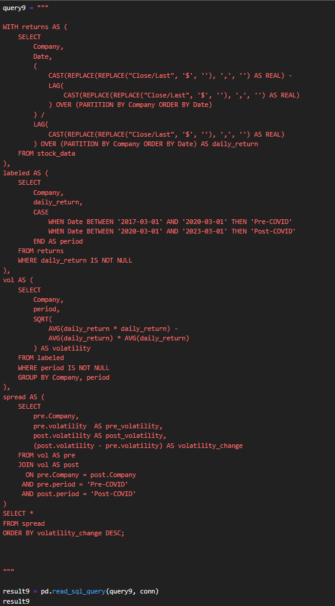
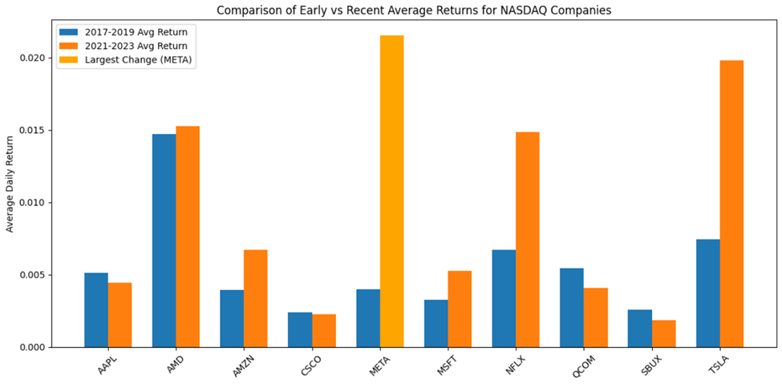

# Investigating the Impact of Market Shifts on Stock Performance of Leading NASDAQ Companies

**Course:** DATA 604, University of Calgary
**Authors:** Bhuvan Dubey (individual milestone + group project) and Akaljot Sangha (group project)

## Problem

Stock prices move constantly because of investor behavior, economic shifts, and major
world events. This project examines how ten leading NASDAQ technology and consumer
companies (Apple, Microsoft, Tesla, Amazon, Meta, Netflix, Starbucks, Cisco, Qualcomm,
and AMD) changed in both **return** and **risk** over a period spanning the COVID-19
pandemic, using SQL and Python on daily stock price data.

Two guiding questions were investigated:
1. Which company experienced the largest change in its average annual return between
   an early period (2017–2019) and a recent period (2021–2023)?
2. How did each company's volatility (standard deviation of daily returns) change
   before vs. after the onset of COVID-19?

## Approach

- Cleaned daily closing prices (stripped `$`/`,` formatting), converted dates to a proper
  datetime type, and sorted by company and date to ensure chronological accuracy.
- Computed **daily returns** as `(Close − Previous Close) / Previous Close`.
- **Question 1 (returns):** aggregated daily returns into average annual returns per
  company, compared the 2017–2019 average against the 2021–2023 average, and ranked
  companies by percent change.
- **Question 2 (volatility):** used SQL window functions (`LAG`) inside CTEs to compute
  daily returns, labeled each observation as Pre-COVID (2017–2019) or Post-COVID
  (2021–2023), then computed volatility (RMS/standard deviation of daily returns) for
  each company/period and ranked the change.
- The group combined an individual return-based notebook (Bhuvan) with an individual
  volatility-based notebook (Akaljot) built on the same cleaned dataset, using shared SQL
  CTEs rather than a `JOIN` — since both analyses drew from the same single table, this
  was noted as a project limitation rather than worked around artificially.

## Key Results

| Company | Early Avg Return (2017–19) | Recent Avg Return (2021–23) | % Change |
|---|---|---|---|
| META | 0.027 | 0.146 | **+440%** |
| TSLA | 0.041 | 0.110 | +166% |
| NFLX | 0.034 | 0.075 | +122% |
| AMZN | 0.029 | 0.050 | +71% |
| MSFT | 0.034 | 0.055 | +62% |
| AMD | 0.048 | 0.071 | +48% |
| CSCO | 0.025 | 0.024 | –4% |
| AAPL | 0.055 | 0.047 | –13% |
| QCOM | 0.033 | 0.025 | –24% |
| SBUX | 0.042 | 0.030 | –28% |

- **META had by far the largest shift in performance** (+440% average annual return),
  driven by post-COVID ad-revenue recovery, AI investment, and cost restructuring after
  the 2021–2022 "Meta crash."
- **Volatility rose most for META (+0.80), NFLX (+0.53), and AMZN (+0.40)** post-COVID,
  showing that the companies with the largest return gains also became meaningfully
  riskier — growth and stability did not move together.
- **CSCO (–0.40) and AMD (–0.33)** became *less* volatile despite slower/negative return
  growth, placing them in a lower-risk, lower-reward category.
- **AAPL and MSFT stayed comparatively stable** in both return and volatility, consistent
  with their position as large, diversified, mature tech companies.

## Tech Stack

- **SQL** (via `sqlite3`/`pandas.read_sql_query`) — CTEs, `LAG` window functions, `CASE`
  statements for period labeling, and aggregation for the group volatility/return analysis
- **Python** (pandas, NumPy, matplotlib) — individual milestone analysis of Question 1
- Dataset: [Stock Market Historical Data of Top 10 Companies](https://www.kaggle.com/datasets/khushipitroda/stock-market-historical-data-of-top-10-companies?resource=download) (Kaggle, sourced from Nasdaq.com)

## Files

- `code/Individual_Milestone_Returns_Analysis.py` — individual milestone (Bhuvan):
  pandas-based cleaning, daily/annual return calculation, and early-vs-recent comparison
  for Question 1, converted from the submitted notebook
- `data/data.csv` — daily price data (Company, Date, Close/Last, Volume, Open, High, Low)
  for the ten companies, 2013–2023
- `report/Proposal.pdf` — initial project proposal (problem, dataset, planned SQL methods)
- `report/Final_Report.pdf` — full group report with SQL queries, statistical hypotheses,
  results tables, discussion, and references
- `presentation/Pitch.pdf` — early project pitch deck
- `presentation/Presentation.pdf` — final presentation deck
- `figures/` — key charts (early vs. recent returns, volatility pre/post-COVID) extracted
  from the final report

## Note on group SQL code

The group's SQL queries (CTEs with `LAG` window functions for daily returns, COVID-period
labeling, and volatility aggregation) are documented as annotated screenshots in
`report/Final_Report.pdf`; the underlying `.ipynb`/SQL script from the shared group
notebook was not available at the time this repo entry was created, so only the
individual milestone script is included as runnable code here.
