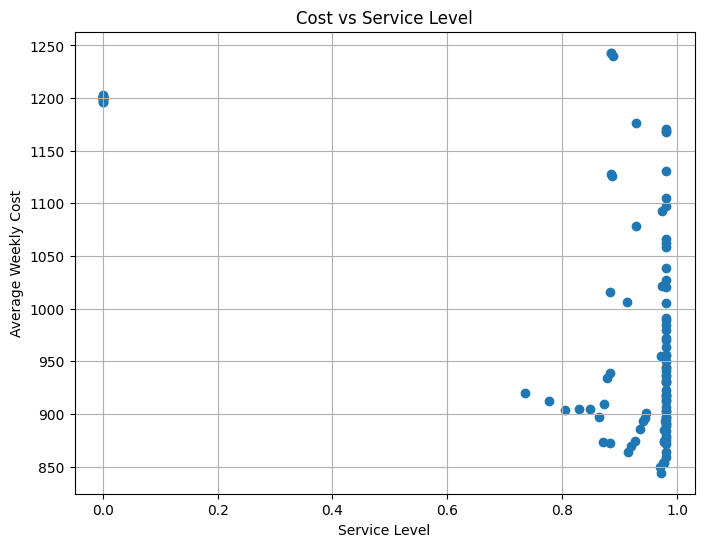
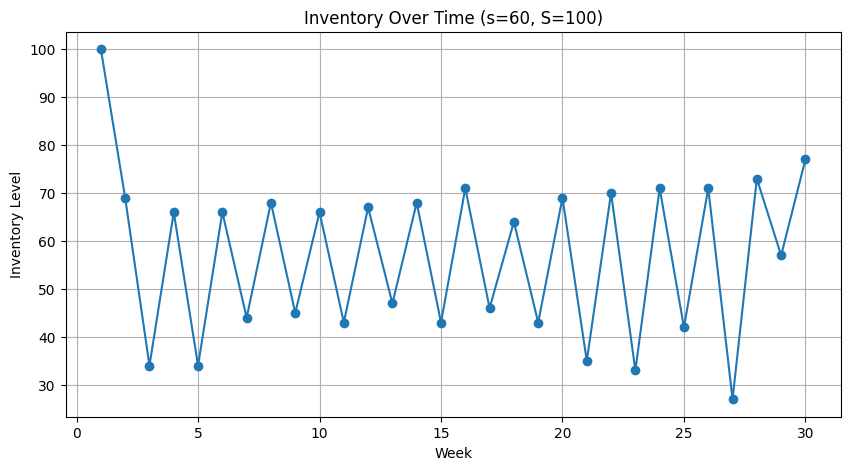

# Optimizing Pediatric Vaccine Inventory Using Simulation Modeling

**Course:** DATA 612 – Decision Analytics, University of Calgary (Winter 2026)
**Author:** Bhuvan Dubey

## Problem

Pediatric clinics have to keep vaccines like MMR, DTaP, and flu shots in stock — but vaccines are expensive, perishable, and demand is uncertain. Too little inventory means missed vaccinations; too much means wasted, expired doses. This project builds a simulation-optimization model to find the inventory policy that minimizes total cost (ordering, holding, shortage, and waste) while keeping service levels high.

## Approach

- Modeled the system as a periodic-review **(s, S) inventory policy**: reorder to level `S` whenever on-hand inventory drops below `s`.
- Weekly demand simulated as **Poisson(λ=30)**; each dose has an 8-week shelf life and is consumed **first-expired-first-out (FEFO)**.
- Ran a **grid search** over candidate `(s, S)` pairs, simulating 200 replications × 52 weeks per policy, to find the cost-minimizing combination.
- Performed a **sensitivity analysis** across demand levels (λ = 25, 30, 35) to test how robust the optimal policy is.
- Since no public dataset captured clinic-level vaccine demand/cost data in enough detail, parameters were set using realistic, literature-informed assumptions (see report for sourcing).

## Key Results

| Metric | Value |
|---|---|
| Optimal policy | s = 60, S = 100 |
| Avg. weekly cost | $844.19 |
| Service level | 97.2% |
| Avg. weekly waste (expired doses) | ~0 |

The cost-vs-service tradeoff is non-linear: pushing service above ~97–98% gets expensive fast, because it requires holding a lot of excess stock. The optimal region (s: 60–80, S: 100–140) is fairly stable — small parameter changes don't blow up costs — which makes the policy practical to implement.

  
  

## Tech Stack

Python (NumPy, pandas, Matplotlib) — see [`Notebook.ipynb`](Notebook.ipynb) for the full simulation, grid search, and sensitivity analysis code.

## Files

- `Notebook.ipynb` — simulation model, grid search, and analysis
- `figures/` — output charts referenced above
