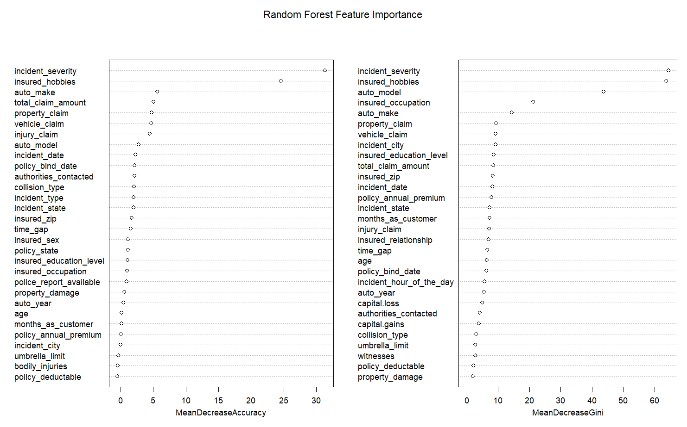
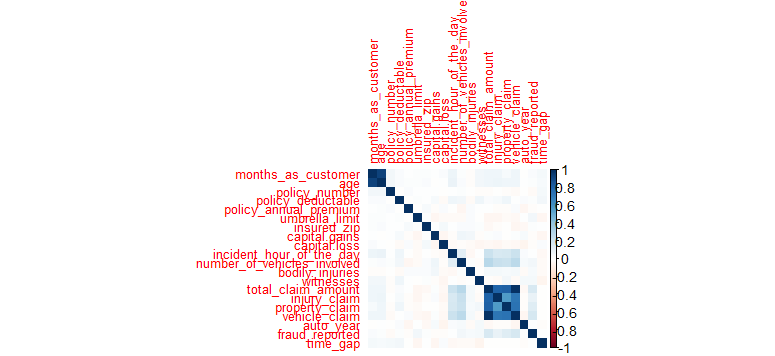
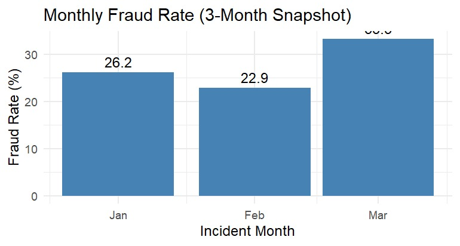
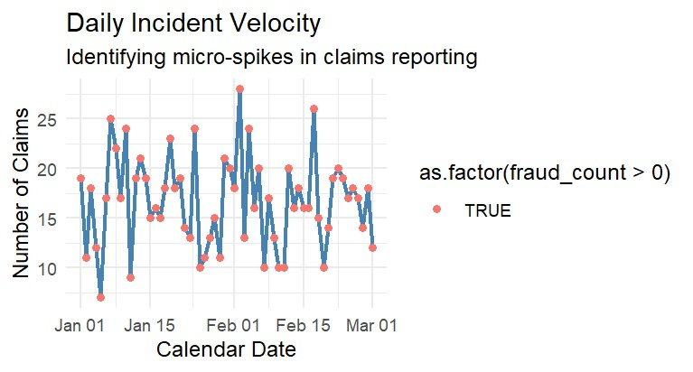

# Detecting and Analyzing Insurance Fraud Using Data Analytics

**Course:** DATA 614 – Advanced Data Analytics, University of Calgary (Winter 2026)
**Team:** Bhuvan Dubey, Gurmol Sohi, Bilal Naseem
**My contributions:** data cleaning/feature engineering, logistic regression + random forest modeling (Q1 & Q2), consolidated final analysis script, PowerBI dashboard

## Problem

Insurance fraud (inflated claims, staged incidents, deception) drives up costs for insurers and, ultimately, premiums for legitimate policyholders. This project uses the [Kaggle Insurance Fraud Detection dataset](https://www.kaggle.com/datasets/arpan129/insurance-fraud-detection) (1,000 claims, 39 variables) to answer three questions:

1. What factors are most strongly associated with fraudulent claims?
2. Can machine learning models accurately predict fraud?
3. How do fraud patterns evolve over time?

## Approach

- **Data prep:** cleaned column names, engineered a `time_gap` feature (days between policy start and incident), converted categoricals to factors.
- **Q1 – Drivers of fraud:** logistic regression (odds ratios + confidence intervals), random forest variable importance, correlation analysis, and chi-square tests on categorical variables.
- **Q2 – Prediction:** 70/30 train-test split; logistic regression as benchmark vs. random forest (300 trees), compared on accuracy, precision, recall, and F1 — with recall weighted more heavily, since missing real fraud is costlier than a false alarm.
- **Q3 – Temporal trends:** the dataset only spans 3 months, which ruled out classical time-series decomposition/ARIMA (too few cycles to model). We pivoted to a **daily/monthly aggregation approach** — monthly fraud rate and daily "incident velocity" — to surface short-term, event-based patterns instead of forcing a seasonal model that the data couldn't support.
- **Dashboard:** built an interactive PowerBI dashboard for exploring the fraud drivers and trends (see `demo/`).

## Key Results

| Model | Accuracy | Precision | Recall | F1 |
|---|---|---|---|---|
| Logistic Regression | 82.94% | 0.689 | 0.568 | 0.622 |
| Random Forest | 82.61% | 0.641 | **0.676** | **0.658** |

Random forest wins on recall and F1 — the metric that matters most for fraud detection, since it catches more real fraud cases even at a modest precision cost.

**Strongest fraud predictors:** incident severity, total claim amount, and accident city/location. **Not predictive:** demographic variables (sex, education, occupation) — an important finding for building fair, non-discriminatory fraud models.

Chi-square tests confirmed `incident_type` (χ²=29.13, p<0.001) and `collision_type` (χ²=31.37, p<0.001) are significantly associated with fraud; `incident_severity` was overwhelmingly significant (χ²=264.24, p≈5.4e-57).

  
  

  
  

## Tech Stack

R (dplyr, ggplot2, caret, randomForest, corrplot, forecast), PowerBI, Excel.

## Files

- `code/Fraud_Analysis.R` — full analysis: data prep, logistic regression, random forest, chi-square tests, temporal aggregation
- `code/Time_Series_Modelling.R` — exploratory classical decomposition/ARIMA attempt (documents why it wasn't viable on this dataset and motivated the pivot above)
- `data/insurance_claims.xlsx` — source dataset
- `demo/Fraud_Dashboard.pbix` — PowerBI dashboard (open in Power BI Desktop)
- `demo/Fraud_Dashboard_Demo.mp4` — short video walkthrough of the dashboard
